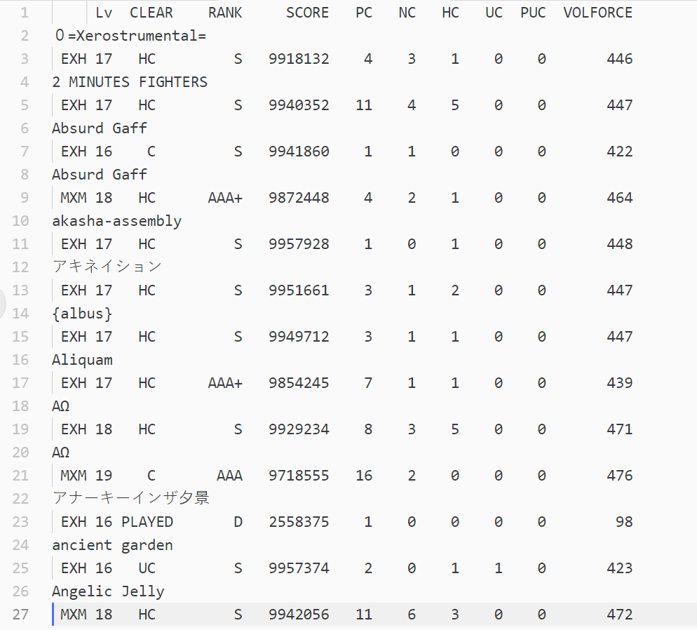
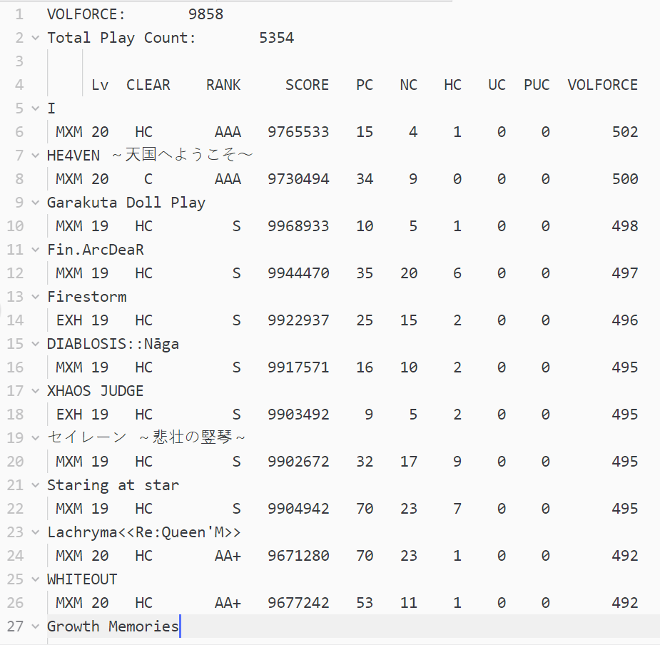

# kshootmania-scoredata
This is a python program to organize your kshootmania scores and calculate your volforce.

The information here is written with respect to Sound Voltex IV Heavenly Haven.

The score data contains the following data for each song:

    Name, Difficulty/Level, Clear Type, Score Rank, Score, PlayCount,
    Normal Clear Count, Hard Clear Count, Ultimate Chain Count, Perfect Count, Volforce

## How to run the program
Place `score_data.py` in your kshootmania **`score`** directory.

There should be a subdirectory with name `PLAYER` (default) or your own username.

In your terminal, type

    python score_data.py [PLAYER_NAME]

Then it will print you total playcount, and you will notice that two additional `.txt` files have been created.

The file `score_data.txt` will contain all of your score data, as shown below.

**Note**: As kshootmania does not distinguish between difficulties `INF/GRV/HVN/MXM`, all 4-th difficulty will be shown as `MXM`

The file `volforce_year_month_date_hour_minute.txt` will contain your total play count and your whole score data, sorted by volforce. The filename also contains the time so that you can check how much your rating has changed over time.

For each song, volforce is calculated by the following equation

    volforce = 25 * (score of song) / 10000000 * (song level + 1) * (score rank)
    score rank: S = 1, AAA+ = 0.99, AAA = 0.98, AA+ = 0.97 ... etc

and your final volforce will be the sum of 20 songs that have the highest volforce, as shown below.

